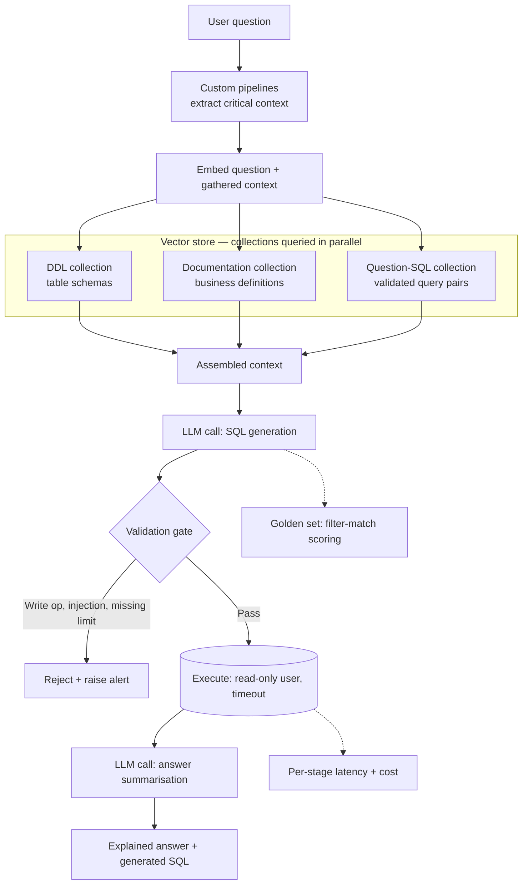

The most dangerous thing a Text-to-SQL system can do is return an answer.

Not an error. Not a timeout. A clean, confident, plausible number — that happens to be wrong.

I built one in production over a database assembled from roughly 250,000 documents. It became the project interviewers asked about most, partly because it was the most extensive thing I'd shipped, and mostly because the company across the table was usually building one too.

This is what I'd tell someone starting theirs.

## Table of contents

## The demo that lies to you

The first version of a Text-to-SQL system is almost always built against a handful of tables, a small hand-picked test set, predictable model responses, and effectively zero concurrency.

Under those conditions it works. Genuinely works. You ask for last quarter's revenue and valid SQL comes back.

Then reality arrives in three directions at once:

- **More tables.** The schema stops fitting in a context window, and the model starts picking plausible-looking wrong ones.
- **More question shapes.** Users ask things your test set never imagined, phrased in ways your prompt never anticipated.
- **More volume.** Concurrency exposes every synchronous call you left in the pipeline.

Each of these breaks the system differently. Schema growth breaks correctness. Question variety breaks semantics. Volume breaks latency. Only the third one is loud.

The other two fail quietly. The query parses. It runs. It returns rows. And it silently joined against a table that double-counts refunds, or filtered on a status column where three of the seven values mean "cancelled," or interpreted "last quarter" as calendar quarter when the business runs on fiscal.

Nobody gets an error. Someone gets a number. That number goes into a deck.

The hard problem was never SQL generation. Models write good SQL. The hard problem is that natural language is ambiguous, schemas encode business logic that appears nowhere in the DDL, and a language model will confidently resolve both for you if you let it.

## The architecture

My implementation was RAG-based, following the pattern established by [Vanna.ai](https://vanna.ai/).

The core idea: don't dump your schema into a prompt. Retrieve exactly the context this question needs, from collections that each do one job.

The components, in order:

**Custom pipelines.** Any extraction or enrichment the question needs before retrieval can be useful — pulling entities, resolving references, gathering whatever critical information your domain requires.

**Embeddings.** The question plus that gathered context becomes the query vector. Embedding the raw question alone throws away signal you've already paid to compute.

**Vector store, three collections.** Covered in detail below — this is the part that matters.

**SQL generation.** One LLM call, with the retrieved context assembled into the prompt.

**Validation.** Read-only enforcement, injection checks, limit enforcement. Before anything touches the database.

**Execution.** Against a read-only user, with a hard timeout.

**Answer summarisation.** A second LLM call that turns the result set into an explained answer. Users asked a question in English; returning a dataframe makes them do the last mile of interpretation themselves — which is exactly where misreadings happen.

## Schema is the real problem — and three collections, not one

Making the model understand your tables is the core task. Most implementations treat this as a single retrieval problem: embed the schema, retrieve the relevant bits, generate.

That gets you *syntactically valid* SQL. It does not get you *correct* SQL.

Splitting retrieval into three collections is what closed that gap:

### 1. DDL collection — the schema

Table definitions, column names, types, keys. This collection determines whether the generated SQL is structurally sound: do these columns exist, can these tables be joined, is the syntax right for this dialect.

Necessary, and nowhere near sufficient.

### 2. Documentation collection — the business

Prose explaining what things mean in your business. What "top customer" refers to. Which of the seven status values actually count as cancelled. Whether the fiscal year starts in April. Which table is authoritative when two of them look like they hold the same thing.

This is knowledge that exists in analysts' heads and in tribal convention, and it is entirely absent from your DDL. If you don't write it down, the model invents it.

### 3. Question-SQL pair collection — worked examples

Validated pairs: a question, and the SQL that correctly answers it, with the right filters applied. This is where you encode the shape of a correct answer rather than describing it.

All three are queried in parallel using pure vector search, which keeps latency close to that of the slowest single collection rather than their sum. Pure vector search is the right default here because the matching you want is semantic — a user asking about "our biggest accounts" should retrieve the documentation entry defining customer size, even with no lexical overlap.

Tune `n` per collection independently. Ten results from each is a reasonable starting point, but the right number depends on your table sizes and how much context you can afford. This is a parameter worth measuring, not guessing — more context is not monotonically better, and it costs you on both latency and price.

## Ambiguity is a first-class problem

"Top customers from last year."

That could mean by total order value, by average order value, or by order count. Three defensible readings, three different queries, three different answers — all of which execute without error.

The model will pick one. It will not tell you it picked one.

This is where collections two and three earn their keep. The documentation collection defines what "top" means in your business. The question-SQL collection shows a worked example with the correct aggregation and filters already applied. Together they collapse the ambiguity before generation rather than after.

The alternative — asking the user a clarifying question — is worth building for genuinely irreducible cases. But most ambiguity in practice isn't irreducible. It's just undocumented.

## Correctness versus validity

This follows directly from the above, and it's the section I'd most want a reader to remember.

A query can be valid and wrong. It parses, it executes, it returns a plausible number, and the number is not the answer to the question that was asked.

The remedy is iterative and unglamorous: when the system picks wrong columns or misapplies a filter, add an example to the question-SQL collection encoding what was actually expected.

One important caveat. **This is setting the sail, not bandaging every leak.** You will never enumerate every possible query. The goal is to steer the system's defaults — which filters it reaches for, which tables it treats as authoritative, how it reads a fuzzy phrase — not to pattern-match your way to full coverage.

Combining worked examples with documentation strings yields far better results than either alone. And keep the division of labour clear in your head:

- The **DDL collection** governs syntactic correctness.
- The **documentation and question-SQL collections** govern semantic correctness.

Nail all three and retrieval stops being your bottleneck.

## Evaluating it

Here's the thing that surprises people: published Text-to-SQL accuracy numbers tell you almost nothing about how your system will behave.

Leading approaches clear 90%+ execution accuracy on Spider's academic setup, land around 73% on BIRD, and fall to roughly 21% on Spider 2.0 — which reframes the task around enterprise workflows with large schemas, multiple SQL dialects, and multi-step interaction. Nothing about the models changed between those numbers. Only the realism did.

The reasons that gap exists are the same reasons your system is hard:

- **Benchmark schemas are clean.** Meaningful names, sane normalisation, small enough to fit in context. Yours has legacy columns nobody's written to in years and business rules encoded as magic values.
- **Benchmark questions are pre-disambiguated.** Annotators wrote each question knowing the gold query, so every question is answerable and unambiguous by construction. Real users ask things with no gold query at all.
- **No public benchmark measures abstention,** because none contains unanswerable questions. The behaviour that matters most in production is the one nobody scores.
- **Execution accuracy over-credits.** Two structurally different queries can return identical rows on one test database and diverge on another.

So the only number that means anything is one you measured on your own schema.

**Build a golden set early — during development, not after.** Ten to twenty diverse queries with their expected filters is enough to start, and it's dramatically more useful than a comprehensive harness you build once everything else is done.

Score it by matching the expected filters against the SQL the system produces. If four of five filters match, you can award partial credit or treat it as a binary failure — and which one you choose should follow from how expensive a wrong answer is in your domain. Where a confidently wrong number does real damage, optimise for recall of the required filters rather than raw accuracy, and accept more abstentions as the price.

## Guardrails

The question here is how to keep your database safe from your own system.

**Read-only paths.** Create a dedicated read-only database user for the generation system. Not a convention, not a prompt instruction — a permission it cannot exceed. Everything else in this list is defence in depth behind this one control.

**Prompt injection.** Attempts to extract schema details, column names, or other structural information should be caught in the prompt layer and raise an alert rather than being answered. Schema disclosure is reconnaissance.

**Row limits.** Tables holding text fields will happily return enormous result sets. Bake `LIMIT 100` or `LIMIT 500` into your worked examples so the pattern propagates into generated queries, except where the question genuinely requires a full scan.

**Query timeouts.** SQL databases lock. A generated query with a bad join can sit there indefinitely, holding resources and blocking real workloads. Set hard timeouts and treat a timeout as a failure to surface, not an error to swallow.

## Scaling and optimisation

### The async trap

The entire pipeline must be asynchronous — and "asynchronous" means more than declaring functions `async`.

The specific failure worth internalising: if you keep a synchronous SQL connector inside an otherwise async pipeline, that connector becomes a blocking statement. Under concurrency it serialises everything behind it, and your carefully async architecture delivers throughput no better than a synchronous one. This is subtle, it doesn't show up in single-user testing, and it is the first thing that breaks under load.

Beyond that: run the vector collection searches in parallel, parallelise custom pipelines, and instrument each stage so you know which one is actually your bottleneck rather than guessing.

### The LLM calls

Two calls per request — generation and summarisation — and both are tunable.

- **Control the context.** Test different values of `n` per collection. Measure accuracy against your golden set at each setting; retrieved context has a point of diminishing and then negative returns.
- **Cap max tokens.** Generated SQL rarely needs more than 200–500 tokens. Capping it saves meaningful cost across volume.
- **Tier your models.** If your query distribution is predictable, move generation to a smaller flash/mini-class model and re-run the golden set to confirm accuracy holds. This is the single largest cost lever available, and the golden set is what makes it a safe change rather than a gamble.
- **Structure prompts for caching.** Static rules and instructions at the top, variable retrieved context at the bottom. Prompt caching then applies to the stable prefix.

### The database

Retrieval and generation get all the attention, but past a certain scale the database is your latency.

- **Consider a purpose-built table.** If answering common questions requires three joins across large tables, you're paying seconds per query. Analytical and transactional systems traditionally live apart for exactly this reason — apply the same logic here.
- **Denormalise deliberately.** Trading redundancy for read performance is the right call when reads dominate, which for a question-answering system they always do.
- **Index where it earns its place.** Long text searches and frequently-applied filters are the obvious candidates.
- **Revisit your isolation level.** If update frequency is low and read volume is high, a looser isolation level avoids lock contention that buys you nothing.

## What I'd do differently

- **Try Hybrid search instead of pure vector.** A BM25 component alongside the vector search would likely have improved schema linking. I would actually build the eval model to test different searches.
- **Golden set from day one.** Building it during development was right; building it *before* the first prompt would have been better. Every prompt change before it existed was an unmeasured change.
- **An explicit abstention path.** The system could always generate SQL. It could not say "I don't have enough context to answer this correctly." Given how much damage a confidently wrong number does, that's the capability I'd prioritise next.
- **Documentation as a maintained artifact.** The documentation collection was populated reactively, when something broke. It should have been a deliberate, reviewed asset owned by someone who understands the business.

## The interview angle

If you're being asked about Text-to-SQL in an interview, the questions that actually separated candidates in my experience were not about SQL generation.

They were: how does your system decide which tables are relevant when the schema doesn't fit in context? How do you know it's correct rather than merely valid? What does it refuse to answer? And how much does a query cost you?

A system that says "I'm not confident about this one" is worth more than one that's right 90% of the time and gives you no way to tell which 90%.